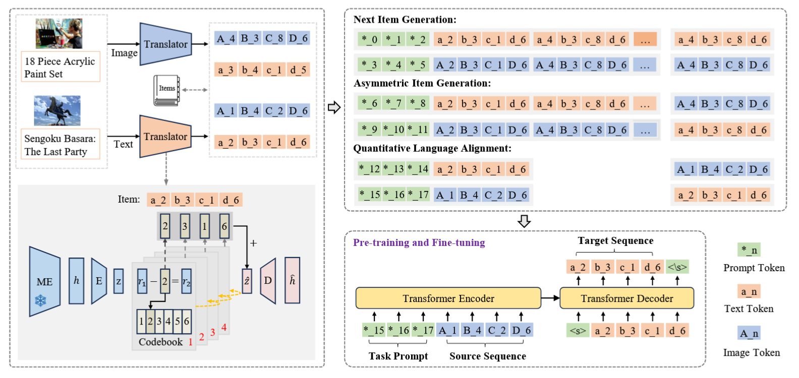
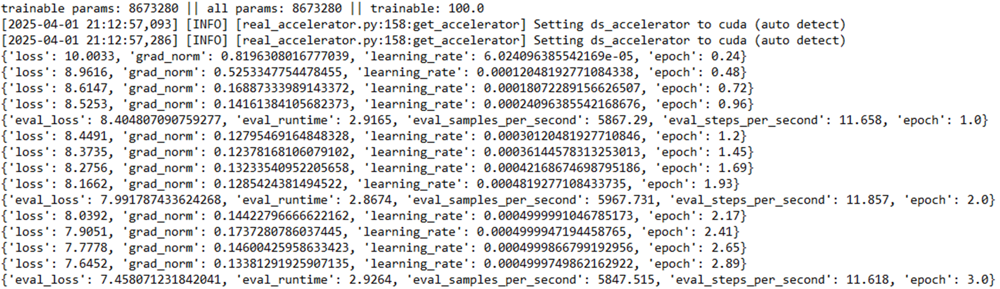
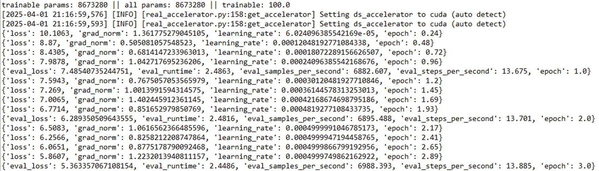
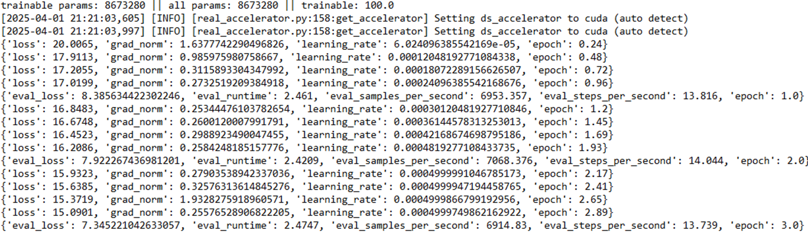

# MQL4GRec

This is the code for the ICLR 2025 paper:  
[**Multimodal Quantitative Language for Generative Recommendation**](https://openreview.net/pdf?id=v7YrIjpkTF)



## Setup

> pytorch==2.1.0  
transformers <= 4.45.0  

- We found that different versions of **transformers** significantly impact convergence speed and performance under default parameters.  
For newer versions, parameter adjustments are required.

We tested different transformers versions with accelerate==0.28.0:  
- v4.47.0 +  
  

- v4.38.2, 4.39.0, 4.40.0  
  

- v4.46.0 shows high training loss  
  

v4.43.0, 4.44.0 are incompatible with accelerate==0.28.0 - version change required.

## Quick Start

### Data Processing
```
cd data_process
```
1. Download images  
2. Process data to ensure each item corresponds to one image and one text description  
3. Generate text embeddings  
4. Generate image embeddings    

Preprocessed data, pretrained checkpoints, and training logs:  
[Google Drive Folder](https://drive.google.com/drive/folders/1eewycbcAJ95atmF_V3bNchPIFDSw_TQC)

### Training the Quantitative Translator
```
cd index
bash script/run.sh          # Run training  
bash script/gen_code_dis.sh # Generate code  
```

### Pre-training
```
bash script/pretrain.sh
```

### Fine-tuning
```
bash finetune.sh
```

## Notes  
- Adjust file paths according to your local directory structure  

## Contributing  
PRs and issues are welcome!  

## License  
N/A  