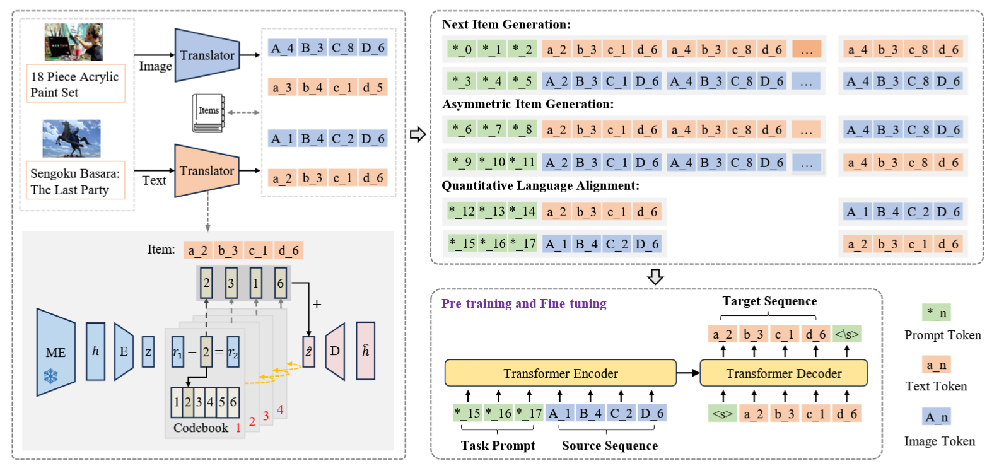
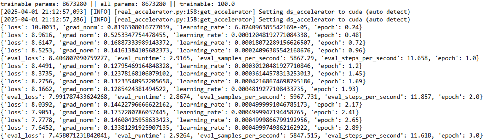
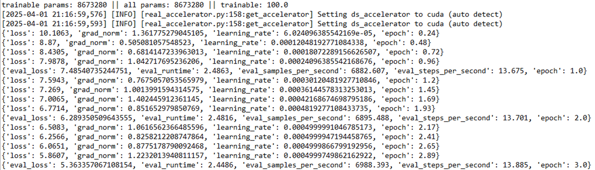
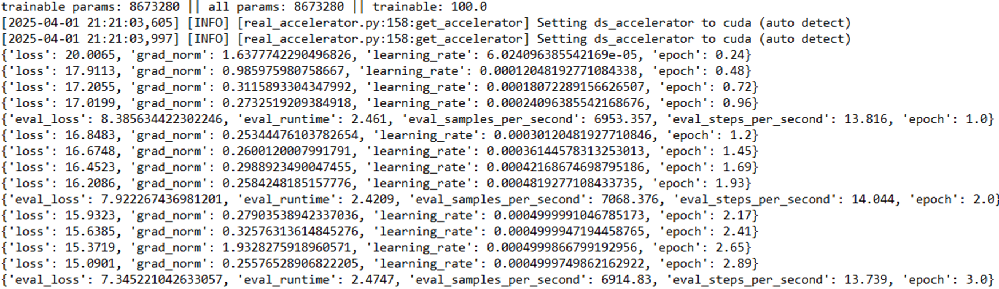

# MQL4GRec

This is the code for the ICLR 2025 paper:  
[**Multimodal Quantitative Language for Generative Recommendation**](https://openreview.net/pdf?id=v7YrIjpkTF)



## Setup

> pytorch==2.1.0  
transformers <= 4.45.0  

- We found that different versions of **transformers** significantly impact convergence speed and performance under default parameters.  
For newer versions, parameter adjustments are required.

We tested different transformers versions with accelerate==0.28.0:  
- v4.47.0, 4.48.0, 4.50.0
  

- v4.38.2, 4.39.0, 4.40.0, 4.45.0
  

- v4.46.0 shows high training loss  
  

v4.43.0, 4.44.0 are incompatible with accelerate==0.28.0 - version change required.

## Quick Start

### Option 1: Automated Data Processing (Recommended)

**NEW**: We now provide automated scripts to download and process Amazon datasets from scratch!

```
cd data_process
```

# Run the full pipeline with one command (downloads data, images, generates embeddings)
```
bash data_process/full.sh
```

See `data_process/README.md` for detailed documentation.

**Available datasets:** Beauty, Fashion, Arts, Automotive, Books, Electronics, Food, Home, Instruments, Movies, Office, Pet, Sports, Toys, Games, and more.


### Training the Quantitative Translator
```
bash index/scripts/run.sh          # Run training  
bash index/scripts/gen_code_dis.sh # Generate code  
```
### Before Pretraining/Finetune:
make sure that you have installed SentencePiece in your environment
```
pip install sentencepiece
```
To change the dataset, make sure you changed both Datasets in 
```
scripts/pretrain.sh
```
 and 
 ```
 scripts/finetune.sh
 ```
### Pre-training
```
sbatch SbatchPretrain.sh
```

### Fine-tuning
```
sbatch SbatchFinetune.sh
```

## Notes  
- Adjust file paths according to your local directory structure  

## Contributing  
PRs and issues are welcome!  

## License  
N/A  
